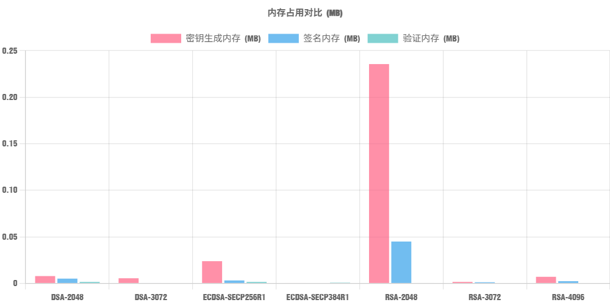
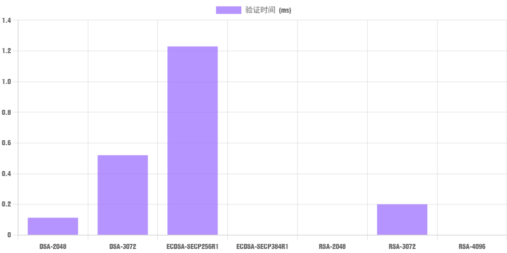

# 数字签名技术数据汇总 (Duplicated)

## **一、引言**

随着多种数字签名算法（RSA、DSA、ECDSA、SM2）在各类安全系统中的广泛应用，亟需建立统一的性能评估框架。本方案旨在提供标准化的测试方法，客观比较算法性能和安全特性。

- #### 测试目标

  - 量化签名生成/验证时间
  - 评估不同密钥长度的性能差异
  - 建立安全性强度映射模型
  - 提供跨平台性能基准

### 二、系统架构

github link：[https://github.com/AGstars/Digital_Sign_test_platform](https://github.com/AGstars/Digital_Sign_test_platform)

### 三、性能测试

#### 测试矩阵

|**算法**|密钥长度/曲线|消息长度|迭代次数|
| -------| ----------------------| ----------------| ----------|
|RSA|2048, 3072, 4096|1KB, 10KB, 1MB|10|
|DSA|2048/224, 3072/256|1KB, 10KB, 1MB|10|
|ECDSA|secp256r1, secp384r1|1KB, 10KB, 1MB|10|
|SM2|sm2p256v1|1KB, 10KB, 1MB|10|

---

#### 消息长度：1KB	迭代次数：10 次

|算法|密钥生成时间 (s)|签名时间 (ms)|验证时间 (ms)|签名长度 (字节)|安全级别 (位)|密钥生成内存 (MB)|签名内存 (MB)|验证内存 (MB)|CPU使用率 (%)|
| -----------------| ------------------| ---------------| ---------------| -----------------| ---------------| -------------------| ---------------| ---------------| ---------------|
|DSA-2048|308.062|0.102|1.059|71|1024|0.008|0.005|0.002|14.31%|
|DSA-3072|1757.260|0.573|0.878|70|1536|0.005|0.000|0.000|18.96%|
|ECDSA-SECP256R1|0.227|0.000|0.354|71|128|0.024|0.003|0.002|0.00%|
|ECDSA-SECP384R1|1.431|2.715|0.472|103|192|0.000|0.000|0.001|10.42%|
|RSA-2048|48.347|1.150|0.000|256|1024|0.236|0.045|0.000|19.41%|
|RSA-3072|157.211|3.529|0.000|384|1536|0.002|0.001|0.000|31.44%|
|RSA-4096|542.078|1.918|1.703|512|2048|0.007|0.002|0.000|28.27%|

---

#### 消息长度：10KB	迭代次数：10 次

|算法|密钥生成时间 (s)|签名时间 (ms)|验证时间 (ms)|签名长度 (字节)|安全级别 (位)|密钥生成内存 (MB)|签名内存 (MB)|验证内存 (MB)|CPU使用率 (%)|
| -----------------| ------------------| ---------------| ---------------| -----------------| ---------------| -------------------| ---------------| ---------------| ---------------|
|DSA-2048|301.294|0.323|0.113|70|1024|0.000|0.000|0.000|16.52%|
|DSA-3072|1598.381|1.139|0.520|71|1536|0.000|0.001|0.000|25.05%|
|ECDSA-SECP256R1|0.059|0.000|1.229|71|128|0.000|0.000|0.000|0.30%|
|ECDSA-SECP384R1|1.526|0.000|0.000|103|192|0.000|0.000|0.000|0.63%|
|RSA-2048|50.505|0.510|0.000|256|1024|0.002|0.000|0.000|5.99%|
|RSA-3072|193.116|0.604|0.200|384|1536|0.005|0.000|0.000|19.00%|
|RSA-4096|490.451|3.171|0.000|512|2048|0.000|0.001|0.000|19.43%|

---

#### 消息长度：1MB	迭代次数：10 次

|算法|密钥生成时间 (s)|签名时间 (ms)|验证时间 (ms)|签名长度 (字节)|安全级别 (位)|密钥生成内存 (MB)|签名内存 (MB)|验证内存 (MB)|CPU使用率 (%)|
| -----------------| ------------------| ---------------| ---------------| -----------------| ---------------| -------------------| ---------------| ---------------| ---------------|
|DSA-2048|328.158|1.290|1.083|71|1024|0.000|0.000|0.000|13.54%|
|DSA-3072|1695.486|1.073|2.876|71|1536|0.000|0.001|0.000|13.29%|
|ECDSA-SECP256R1|0.000|0.841|1.418|71|128|0.000|0.000|0.000|3.50%|
|ECDSA-SECP384R1|0.740|1.883|1.847|103|192|0.000|0.000|0.000|8.75%|
|RSA-2048|49.401|0.306|1.263|256|1024|0.000|0.000|0.000|24.84%|
|RSA-3072|167.448|2.788|0.559|384|1536|0.001|0.000|0.000|19.83%|
|RSA-4096|457.993|5.429|0.509|512|2048|0.000|0.000|0.000|12.27%|

---

### 四、性能指标拆解对比

#### 1. 计算时间

- **密钥生成**：DSA 算法随密钥长度提升（2048→3072），生成时间飙升（328.158s→1695.486s ）；ECDSA 整体耗时低，SECP256R1 近乎瞬时，SECP384R1 也仅 0.740s ；RSA 同样随密钥增长（2048→4096 ），生成时间显著增加（49.401s→457.993s ）。ECDSA 在密钥生成效率上优势明显，DSA 3072 位、RSA 4096 位场景下，密钥生成耗时极高。
- **签名时间**：RSA 表现突出，2048 位时仅 0.306ms ，但 4096 位增长到 5.429ms ；ECDSA 中 SECP256R1 仅 0.841ms ，SECP384R1 稍高（1.883ms ）；DSA 2048 位为 1.290ms ，3072 位略降（1.073ms ，因密钥生成耗时占主导，签名逻辑相对稳定 ）。
- **验证时间**：RSA 4096 位仅 0.509ms ，3072 位 0.559ms ，验证效率优；ECDSA SECP256R1 验证 1.418ms ，SECP384R1 1.847ms ；DSA 3072 位因安全级别提升（1536 位 ），验证时间升至 2.876ms ，2048 位则 1.083ms 。

#### 2. 签名长度

RSA 随密钥增长（2048→4096 ），签名长度从 256 字节→512 字节线性增加；DSA 固定 71 字节，ECDSA 因曲线不同有差异（SECP256R1 71 字节，SECP384R1 103 字节 ）。若对传输 / 存储容量敏感（如低带宽物联网 ），DSA、ECDSA SECP256R1 更优。

#### 3. 验证效率（结合 CPU 使用率 ）

RSA 2048 位 CPU 使用率 24.84% ，虽验证时间短，但算力开销高；ECDSA 整体 CPU 占比低（SECP256R1 仅 3.50% ），能效比优；DSA 3072 位 CPU 占比 13.29% ，但密钥生成耗时拖累整体效率。若设备算力有限（如嵌入式 ），ECDSA 更适配。

#### 4. 安全性（安全级别 ）

安全级别需结合密钥长度看：ECDSA SECP256R1 以 128 位等效安全，却实现与 RSA 1024 位、DSA 1024 位相近功能，“短密钥高安全” 优势显著；RSA 4096 位（2048 等效安全 ）、DSA 3072 位（1536 等效安全 ）需更长密钥达更高安全，ECDSA 凭借椭圆曲线数学特性，在安全与资源开销间平衡更好。

### 五、应用场景适配性分析

#### 1. 高频签名验证、资源受限场景（如物联网终端、移动 App ）

**推荐 ECDSA - SECP256R1**：密钥生成近乎瞬时，签名 / 验证时间短（0.841ms/1.418ms ），CPU 占比仅 3.50% ，签名长度 71 字节。适合设备性能弱、需频繁交互验签场景（如蓝牙设备认证、移动支付签名 ），以低资源开销保障安全。

#### 2. 传统服务端、对兼容性要求高（如旧系统升级、通用数字签名 ）

**RSA（2048/3072 位 ）** ：生态兼容成熟（SSL 证书等广泛用 RSA ），2048 位签名验证快（0.306ms/1.263ms ），适合服务端算力相对充足、需适配现有系统场景。但 4096 位密钥生成与签名耗时陡增，需权衡安全与效率；若追求更高安全且容忍一定性能开销，可选 RSA 3072/4096 ，但注意 CPU 使用率（24.84%/12.27% ）对服务端并发的影响。

#### 3. 对签名长度极敏感、安全需求适中场景（如低带宽卫星通信、区块链轻节点 ）

**DSA - 2048**：签名长度固定 71 字节，密钥生成 328s 虽长（若密钥预生成可缓解 ），签名 / 验证时间 1.290ms/1.083ms 尚可，安全级别 1024 位。适合对签名体积严格限制、密钥更新频率低场景（如卫星终端长期认证 ），预先生成密钥，利用固定短签名长度适配窄带传输。

#### 4. 高安全需求、可接受一定性能开销场景（如金融核心系统、政务加密 ）

**ECDSA - SECP384R1 或 RSA - 4096**：ECDSA SECP384R1 安全级别 192 位，密钥生成 0.740s ，签名 / 验证 1.883ms/1.847ms ，CPU 占比 8.75% ，较 RSA 4096（密钥生成 457s 、签名 5.429ms ）更平衡；RSA 4096 安全级别 2048 位等效，适合对 “传统 RSA 生态依赖深 + 极致安全” 场景，但需承担高密钥生成与签名耗时。若追求高效高安全，ECDSA SECP384R1 更优。

### 六、总结

- **轻量高频场景**：ECDSA - SECP256R1 以 “低资源 + 高安全性价比” 称王；
- **兼容传统场景**：RSA 2048/3072 平衡适配性与基础安全；
- **短签名硬需求**：DSA - 2048 靠固定短签名占优（需容忍密钥生成耗时 ）；
- **高安全场景**：ECDSA - SECP384R1 比 RSA 4096 更高效，是资源与安全平衡的优选。

实际选型需结合 **设备性能、安全要求、交互频率、生态兼容性** 综合决策，椭圆曲线算法（ECDSA ）凭借 “短密钥高安全 + 低资源开销” ，在新兴场景（物联网、区块链 ）中应用愈发广泛，逐步替代部分传统 RSA/DSA 场景。
